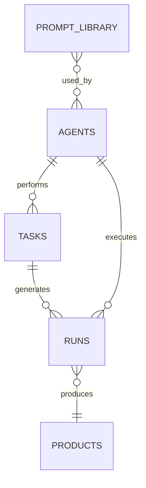

# Agent Ops Dashboard (Notion Template)

**Version 1.0 | For Solo Builders & Small AI Teams**

This is a complete, ready-to-duplicate Notion workspace for operating your AI agents at scale.

## Quick Start
1. Duplicate this page into your Notion workspace.
2. Duplicate the linked databases.
3. Populate with your agents and start logging runs.
4. Customize views and properties as needed.

---

## Core Databases

### 1. Agents Registry
- **Name** (Title)
- **Type** (Select: Research, Content, Coding, Marketing, Ops, Custom)
- **Model** (Select: grok-4.3, claude-3.5, gpt-4o, etc.)
- **Provider** (xAI, Anthropic, OpenAI, Local)
- **Cost per 1k tokens** (Number)
- **Status** (Active / Paused / Archived)
- **Description** (Text)
- **Last Used** (Date)
- **Total Runs** (Relation / Rollup)
- **Avg Success Rate** (Number / Formula)
- **Notes** (Text)

**Views:**
- All Active Agents (board or table)
- By Provider
- High Usage

### 2. Tasks
- **Task Name** (Title)
- **Agent** (Relation to Agents)
- **Status** (Select: Todo, In Progress, Done, Failed, Reviewed)
- **Priority** (Select: High, Medium, Low)
- **Due Date** (Date)
- **Input** (Text / Rich text - the prompt or task description)
- **Output** (Text - link or pasted result)
- **Tokens Used** (Number)
- **Cost** (Formula: tokens * cost per 1k)
- **Duration** (Number - minutes)
- **Success** (Checkbox)
- **Tags** (Multi-select)
- **Run Log** (Relation to Runs)

### 3. Runs (History)
- **Run ID** (Title - auto or timestamp)
- **Date** (Date)
- **Agent(s)** (Relation)
- **Task** (Relation)
- **Input Summary** (Text)
- **Output Link** (URL or file)
- **Tokens** (Number)
- **Cost** (Number)
- **Duration** (Number)
- **Success Rate** (Number 0-100)
- **Notes / Learnings** (Text)
- **Linked to Product** (if selling the output)

**Views:**
- Recent Runs (sorted by date desc)
- Cost by Agent (grouped)
- Successful Runs only
- Calendar view

### 4. Metrics & Analytics (Summary Dashboard)
Use Notion's built-in charts or linked views:
- Total Cost This Month (rollup + formula)
- Runs This Week
- Avg Cost per Run
- Top Performing Agents
- ROI per Agent (if tracking revenue from outputs)

Add a main "Dashboard" page with embedded views, gauges (via embeds if wanted), and a quick "Start New Run" template button.

---

## Additional Pages / Sections

### Prompt Library (linked database)
- Reusable prompts categorized by agent type.
- Version history.
- Success examples.

### Crew Templates
- Pre-built sets of agents + tasks for common workflows (link to MCP Tool Pack).

### Cost Tracker
- Monthly budget.
- Per-provider spending.
- Alerts (manual or via automation if using Notion API later).

### Resources & Links
- Your xAI Console
- CrewAI docs
- Favorite agent repos

### Quick Actions
- Button-style pages or synced blocks for:
  - "Log New Run" (template)
  - "Add New Agent"
  - "Weekly Review" template

---

## Recommended Properties & Formulas (Copy-Paste Ready)

**Cost Formula example (in Runs DB):**
`prop("Tokens") * (prop("Agent") ? 0.002 : 0.002) / 1000` (adjust per model)

**Success % Rollup** from Agents to show average.

**Status Formula:**
If status is Done and Success checked → "Completed", else etc.

---

## Screenshots to Create (for marketing)
1. Main Dashboard overview with all views.
2. Agent Registry table.
3. Runs calendar + cost chart.
4. Example of a completed agent run with linked output.
5. Mobile view (Notion is great on mobile).

**Forge Aesthetic Tip:** Use dark mode, blue accents (#3b82f6), clean icons (use Notion's or emoji like 🤖 ⚙️ 📊).

---

## Bonus: Automation Ideas (Future)
- Use Notion API + Zapier/Make to auto-log runs from your CrewAI scripts.
- Webhook from Gumroad sales to mark "productized" runs.

---

**This template turns chaotic agent experiments into a real operating system.**

Duplicate, fill it with your first 3 agents, and start shipping.

---

## Dashboard Page Layout

Create a hub page **"Agent Ops HQ"** with these linked views (drag database views onto the page):

```
┌─────────────────────────────────────────────────────────┐
│  AGENT OPS HQ                              [+ Log Run]  │
├─────────────────────────────────────────────────────────┤
│  KPIs (linked views or callouts)                        │
│  • Runs this week    • Spend MTD    • Success rate      │
├──────────────────────┬──────────────────────────────────┤
│  Active Agents       │  Recent Runs (last 14 days)      │
│  (board by Status)   │  (table, sorted by date)         │
├──────────────────────┼──────────────────────────────────┤
│  Tasks In Progress   │  Cost by Agent (bar chart)       │
├──────────────────────┴──────────────────────────────────┤
│  Prompt Library (favorites)  │  Products Shipped (rollup) │
└─────────────────────────────────────────────────────────┘
```

---

## Copy-Paste Formulas (Notion)

### Runs → Cost (adjust rate per agent in Agents DB)

In **Runs** database, add formula property `Cost USD`:
```
if(
  empty(prop("Tokens")),
  0,
  prop("Tokens") / 1000 * 0.002
)
```
*Replace `0.002` with your model's $/1k tokens from Agents registry.*

### Runs → Status label

Formula `Run Status`:
```
if(prop("Success"), "✅ Success", if(prop("Tokens") > 0, "⚠️ Failed", "⏳ Running"))
```

### Agents → Success rate rollup

On **Agents**, rollup from Runs:
- Property: `Success` (checkbox on Runs)
- Calculation: `Percent checked`

### Tasks → Overdue flag

Formula `Overdue`:
```
if(
  and(prop("Status") != "Done", prop("Due Date") < now()),
  "🔴 Overdue",
  ""
)
```

---

## Sample Starter Data (duplicate into DBs)

### Agents Registry — seed rows

| Name | Type | Model | Provider | Status |
|------|------|-------|----------|--------|
| Niche Scout | Research | grok-4 | xAI | Active |
| Content Producer | Content | claude-sonnet | Anthropic | Active |
| Quality Reviewer | Ops | grok-4 | xAI | Active |

### Runs — example log entry

| Run ID | Agent | Tokens | Cost | Success | Notes |
|--------|-------|--------|------|---------|-------|
| 2026-06-19-research-01 | Niche Scout | 4200 | 0.84 | ✅ | Found 3 niches; picked law-student prompts |

---

## Weekly Review Template (duplicate as page)

**Week of:** [DATE]

1. **Runs:** ___ total | ___ successful | $___ spent
2. **Products:** shipped ___ | published ___ | sold ___
3. **Winner run:** (link) — what made it good?
4. **Loser run:** (link) — what to change?
5. **Prompt to save:** (paste)
6. **Next week:** one ship goal + one marketing goal

---

## Property Options (Select fields)

**Agents → Type:** Research, Content, Coding, Marketing, Ops, Sales, Custom

**Tasks → Status:** Todo, In Progress, Blocked, Done, Failed, Reviewed

**Tasks → Priority:** P0 Critical, P1 High, P2 Medium, P3 Low

**Runs → Linked to Product:** relation to optional **Products** DB (title, Gumroad URL, price, sales)

### Optional Products DB

| Property | Type |
|----------|------|
| Product Name | Title |
| Status | Draft / Live / Archived |
| Gumroad URL | URL |
| Price | Number |
| Sales | Number |
| Revenue | Number |
| Source Run | Relation → Runs |

---

## Mobile Ops Workflow

1. Trigger crew from laptop
2. Paste output link into Runs from phone
3. Mark Success + Notes while fresh
4. Friday: open Weekly Review on mobile, 10 min

---

## 30-Minute Setup Walkthrough

**Minutes 0–5: Create databases**

1. In Notion, create a full-page database: **Agents**
2. Create **Tasks**, **Runs**, **Prompt Library**, **Products** (optional but recommended)
3. Add properties from schemas below — don't perfectionism on day one

**Minutes 5–15: Wire relations**

```
Agents ←→ Tasks (Agent relation on Tasks)
Tasks ←→ Runs (Run Log relation on Tasks; Task relation on Runs)
Runs ←→ Products (relation both ways)
Agents ←→ Runs (Agent(s) relation on Runs)
Prompt Library → Agents (optional: Used By relation)
```

**Minutes 15–25: Build hub page**

1. New page: **Agent Ops HQ**
2. Type `/linked` and embed: Active Agents (table), Recent Runs (table), Tasks In Progress (board)
3. Add callout blocks for manual KPIs until rollups populate

**Minutes 25–30: Seed data**

1. Add 3 agents from sample table below
2. Log one fake run to test formulas
3. Duplicate **Weekly Review** page template

---

## Database Relation Map



---

## Prompt Library Database (full schema)

| Property | Type | Notes |
|----------|------|-------|
| Prompt Name | Title | Short identifier |
| Category | Select | Research, Content, Coding, Marketing, Meta, Legal-Study |
| Agent Type | Select | Matches Agents.Type |
| Model Tested | Multi-select | grok-4, claude-sonnet, gpt-4o-mini |
| Prompt Body | Text | Full copy-paste prompt |
| Variables | Text | List of `[BRACKETS]` |
| Version | Number | Increment on edits |
| Quality Score | Select | 1–10 or ⭐ rating |
| Last Used | Date | |
| Used By Agent | Relation | → Agents |
| Success Example | Text | Link or paste best output |
| Notes | Text | What makes this work |

**Views to create:**
- **Favorites** — filter Quality ≥ 8
- **By Category** — board grouped by Category
- **Needs Test** — empty Last Used or Version = 1

---

## Page Templates (duplicate in Notion)

### Template: Log New Run

```
## Run: [AUTO — date + crew name]

**Agent(s):** [relation]
**Task:** [relation]
**Input summary:** [1–2 sentences]
**Output link:** [URL or file path]
**Tokens:** [number]
**Duration (min):** [number]
**Success:** [ ] Yes  [ ] No

**Learnings:**
- What worked:
- What failed:
- Prompt to save to library:

**Product link:** [relation to Products if applicable]
```

### Template: Add New Agent

```
## Agent: [NAME]

**Type:** Research / Content / Coding / Marketing / Ops
**Model:** 
**Provider:** 
**Cost per 1k tokens:** 
**Status:** Active

**Goal (one sentence):**
**When to use:**
**YAML / config path:**
**Notes:**
```

### Template: Weekly Review (expanded)

```
# Weekly Review — Week of [DATE]

## Numbers
| Metric | Value |
|--------|-------|
| Total runs | |
| Successful runs | |
| Spend (USD) | |
| Products shipped | |
| Products published | |
| Sales | |
| Revenue | |

## Wins
1. Best run (link): 
2. Best prompt saved: 
3. Best customer signal: 

## Losses
1. Worst run (link): 
2. Root cause: 
3. Fix for Optimizer crew: 

## Next week
- [ ] One ship goal: 
- [ ] One marketing goal: 
- [ ] One optimizer experiment: 

## Crew to run Friday
- [ ] Data Analyzer (08) if sales data exists
- [ ] Agent Optimizer (10) always
```

---

## View Configuration (step-by-step)

### Runs → "Cost by Agent"
1. Create table view **Cost by Agent**
2. Group by: **Agent(s)**
3. Show properties: Date, Tokens, Cost, Success
4. Sort: Date descending
5. Optional: Notion chart — sum Cost by Agent

### Tasks → "This Week"
1. Filter: Due Date is this week OR Status is In Progress
2. Sort: Priority ascending
3. Board view grouped by Status

### Products → "Live on Gumroad"
1. Filter: Status = Live
2. Show: Price, Sales, Revenue, Gumroad URL, Source Run
3. Sort: Revenue descending

---

## AgentForge Integration Notes

If you use AgentForge Digital locally:

| AgentForge | Notion field |
|------------|--------------|
| `products.db` → products | Products DB manual sync or weekly paste |
| `run_history` table | Export to Runs DB |
| `agentforge.log` | Paste errors into Run Notes |
| `generated_products/` path | Output Link on Runs |

**Manual sync query (weekly):**
```sql
SELECT topic, decision, quality_score, profit_score,
       est_cost_cents/100.0 AS cost_usd, published, timestamp
FROM run_history ORDER BY timestamp DESC LIMIT 10;
```

Paste into a Notion page or one row per run.

---

## Law Student / Professional Customization

Optional **Agents** to register:

| Name | Type | Use |
|------|------|-----|
| IRAC Tutor | Content | Exam prep crews |
| Research Scout | Research | Case/topic research |
| Writing Polisher | Content | Memo structure — not advice |

Add disclaimer callout on hub page:
> *Study and productivity tooling only. Not legal advice.*

**Prompt Library category:** add `Legal-Study` select option.

Tag Runs that produce sellable study aids with `legal-adjacent` for filtering.

---

## Forge Aesthetic Checklist

- [ ] Dark mode default on hub page
- [ ] Cover image: dark blue gradient (#0f1117 → #161a24)
- [ ] Icon: 🤖 or custom Forge mark
- [ ] Accent color #3b82f6 on callouts and dividers
- [ ] Consistent emoji in view names: 📊 Runs, ⚙️ Agents, 📦 Products

---

## Troubleshooting

| Problem | Fix |
|---------|-----|
| Cost formula shows 0 | Tokens empty or rate wrong — check Agents cost field |
| Relations don't appear | Create relation property on BOTH sides if needed |
| Too much logging friction | Use **Log New Run** template only — skip Tasks for small runs |
| Dashboard feels empty | Seed 5 fake runs, delete later — need data for views |

---

(End of template. Create databases first → relations → hub page → seed → weekly rhythm.)